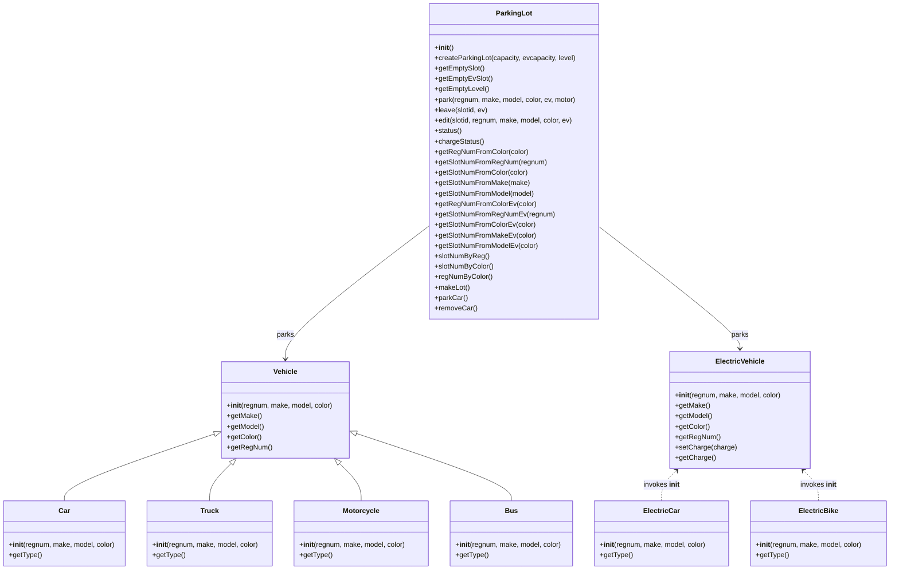

# Original Baseline Architecture (Pre-Refactor)

This class diagram represents the structural architecture of the original Parking Lot Manager codebase prior to any refactoring.

```mermaid
classDiagram
    %% Baseline: Original Pre-Refactor Architecture

    class Vehicle {
        +__init__(regnum, make, model, color)
        +getMake()
        +getModel()
        +getColor()
        +getRegNum()
    }

    class Car {
        +__init__(regnum, make, model, color)
        +getType()
    }

    class Truck {
        +__init__(regnum, make, model, color)
        +getType()
    }

    class Motorcycle {
        +__init__(regnum, make, model, color)
        +getType()
    }

    class Bus {
        +__init__(regnum, make, model, color)
        +getType()
    }

    class ElectricVehicle {
        +__init__(regnum, make, model, color)
        +getMake()
        +getModel()
        +getColor()
        +getRegNum()
        +setCharge(charge)
        +getCharge()
    }

    class ElectricCar {
        +__init__(regnum, make, model, color)
        +getType()
    }

    class ElectricBike {
        +__init__(regnum, make, model, color)
        +getType()
    }

    class ParkingLot {
        +__init__()
        +createParkingLot(capacity, evcapacity, level)
        +getEmptySlot()
        +getEmptyEvSlot()
        +getEmptyLevel()
        +park(regnum, make, model, color, ev, motor)
        +leave(slotid, ev)
        +edit(slotid, regnum, make, model, color, ev)
        +status()
        +chargeStatus()
        +getRegNumFromColor(color)
        +getSlotNumFromRegNum(regnum)
        +getSlotNumFromColor(color)
        +getSlotNumFromMake(make)
        +getSlotNumFromModel(model)
        +getRegNumFromColorEv(color)
        +getSlotNumFromRegNumEv(regnum)
        +getSlotNumFromColorEv(color)
        +getSlotNumFromMakeEv(color)
        +getSlotNumFromModelEv(color)
        +slotNumByReg()
        +slotNumByColor()
        +regNumByColor()
        +makeLot()
        +parkCar()
        +removeCar()
    }

    %% Inheritance Relationships mapping directly from code
    Vehicle <|-- Car
    Vehicle <|-- Truck
    Vehicle <|-- Motorcycle
    Vehicle <|-- Bus

    %% Composition/Dependencies for EV classes (implicit inheritance without explicit base class in declaration)
    ElectricVehicle <.. ElectricCar : invokes __init__
    ElectricVehicle <.. ElectricBike : invokes __init__
    
    %% Associations
    ParkingLot --> Vehicle : parks
    ParkingLot --> ElectricVehicle : parks
```
