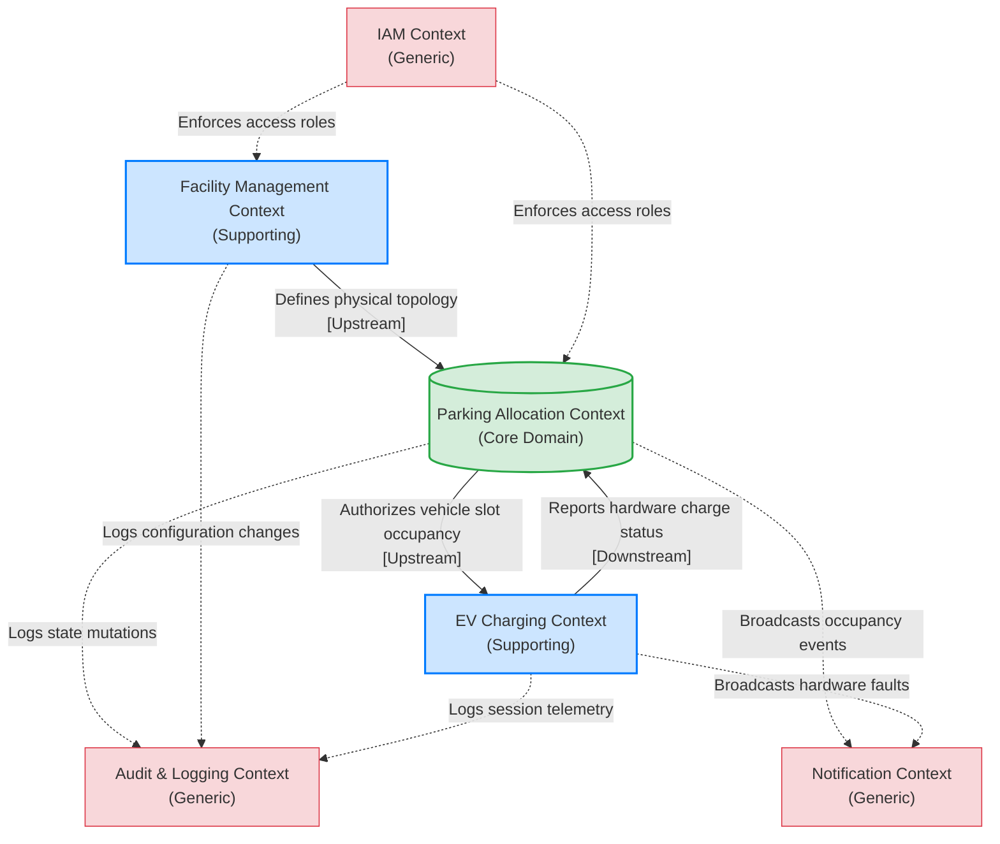

# EasyParkPlus: Bounded Context Map

This diagram illustrates the high-level integration relationships between the Bounded Contexts identified in the EasyParkPlus Domain-Driven Design analysis. The map highlights conceptual collaborations and data dependencies, purposefully excluding technical deployment details, database schemas, or specific API endpoints.

### Context Integration Summary
- **Facility Management -> Parking Allocation:** Facility defined parameters (like total EV capacities and floor counts) act as the foundational upstream data dependency that restricts the mathematical rules of the Parking Allocation context.
- **Parking Allocation <-> EV Charging:** A bidirectional relationship exists where Parking Allocation dictates *who* is allowed in an EV slot (Upstream Authorization), while EV Charging continuously reports *what* is happening at the hardware level back to the core system (Downstream Telemetry).
- **Generic Dependencies:** The IAM, Audit, and Notification generic domains act as cross-cutting infrastructural companions. Operations across the distinct supporting and core boundaries rely natively on these contexts for unified security, legal audit tracking, and system-wide visibility.
