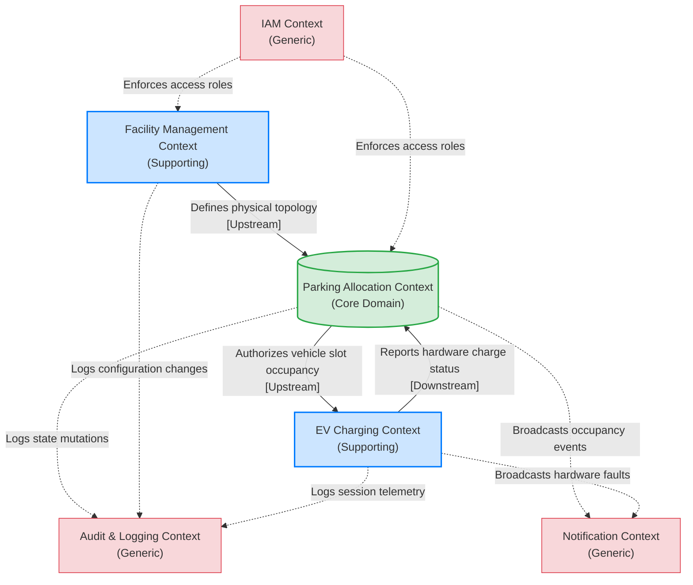

# EasyParkPlus DDD Stakeholder Review Package

**Project:** EasyParkPlus Parking Management System Refactoring
**Phase:** Domain-Driven Design (DDD) Foundation & Bounded Context Mapping
**Target Audience:** Technical Leadership, Business Stakeholders, Course Graders

*This document serves as the consolidated review package for the Domain-Driven Design analysis of the EasyParkPlus system. It formally defines the core domains, bounded context mappings, and ubiquitous language required to safely transition the application from a single-lot legacy prototype into a maintainable multi-facility microservices architecture.*

---

## 1. Domain & Subdomain Analysis

To enable multi-facility scaling, the business landscape has been categorized into the following foundational subdomains:

*   **Core Domain: Parking Allocation & Resource Management**
    *   *Purpose:* The fundamental competitive differentiator. Manages the real-time mapping of transient vehicles to finite physical slots, enforcing capacity ceilings and specialized vehicle routing constraints (e.g., EVs vs. standard).
*   **Supporting Subdomain: Facility Hierarchy Management**
    *   *Purpose:* Defines the static physical topology (Facilities, Floors, Zones) providing the capacity blueprints that constrain the Core Domain.
*   **Supporting Subdomain: EV Charging Station Management**
    *   *Purpose:* Orchestrates the specialized hardware lifecycle, managing telemetry (battery %) and diagnostic health independently of allocation routing.
*   **Generic Subdomains**
    *   *IAM (Identity & Access Management):* Secures administrative actions.
    *   *Audit & Logging:* Captures immutable systemic footprints for compliance.
    *   *Notification:* Dispatches decoupled real-time alerts and presentation UI updates.

---

## 2. Bounded Context Map

The following map illustrates the conceptual integration boundaries and data flows orchestrating the subdomains.

---

## 3. Top-Level Conceptual Aggregates

*   **Facility Aggregate** *(Root: Facility)*: Ensconces physical topography. Mutating Floors or Zones routes exclusively through this root to defend licensed structural capacity limits.
*   **Allocation Aggregate** *(Root: Allocation)*: Ensconces the lifecycle of a parked vehicle. Atomically ensures that a vehicle Check-in perfectly mirrors a Slot changing status from Free to Occupied.

---

## 4. Ubiquitous Language Glossary

### Parking Allocation Context (Core)
| Term | Definition |
| :--- | :--- |
| **Allocation** | The official, real-time commitment of a physical slot to a specific vehicle for a duration of time. |
| **Capacity** | The designated numerical limit of vehicles allowed within a facility or a specific zone at one time. |
| **Check-in** | The business process initiated when a vehicle officially consumes an available slot. |
| **Release** | The business process initiated when a vehicle vacates a slot, making it available for a new allocation. |
| **Slot** | The atomic unit of facility inventory. Always holds an explicit state of "Free" or "Occupied." |

### Facility Management & EV Charging Contexts (Supporting)
| Term | Definition |
| :--- | :--- |
| **Facility** | A geographically distinct parking enterprise containing levels and zones. |
| **Topology** | The static structural map and configuration of the entire parking network. |
| **Charger** | The specific physical hardware infrastructure that provides energy to a vehicle parked in an EV-designated slot. |
| **Charge Percentage** | The real-time fuel/energy level reported by the vehicle's battery during an active session (distinct from physical Floor *Level*). |

---

## 5. Key Assumptions & Open Questions for Review

Below is the consolidated log of discovery-phase findings. We explicitly request business and technical stakeholders to validate these assumptions and clarify the open questions to ensure structural alignment prior to writing microservice specifications.

### Key Assumptions (Pending Validation)

*   **Assumption 1: Core Domain Boundary [High Impact / Low Uncertainty]**
    *   *Finding:* The legacy system mixed physical charging status and UI updates with allocation logic.
    *   *Assumption:* The fundamental business differentiator is *Parking Allocation* (multi-facility supply vs. demand routing). Consequently, UI rendering and hardware telemetry (EV charging) are classified as structurally separate Subdomains.
*   **Assumption 2: Deferred Business Processes [Medium Impact / Medium Uncertainty]**
    *   *Finding:* Documentation and legacy logic contained no provisions for payments or pre-booking capabilities.
    *   *Assumption:* Features like 'Dynamic Pricing/Billing', 'Reservations', and 'Penalty Enforcement' are completely out-of-scope for this phase of the architecture and will be modeled as separate Contexts in future sprints if required.

### Open Questions (Requiring Stakeholder Clarification)

*   **Question 1: Multi-Facility Data Consistency Constraints [High Impact]**
    *   *Domain:* Facility Management & Allocation
    *   *Query:* Does the business require absolute real-time (synchronous) confirmation that a facility's maximum capacity is upheld across the entire global network, or is eventual (asynchronous) consistency acceptable during brief network partitions between edge facilities and the central database?
*   **Question 2: EV Subdomain Authority over Check-outs [Medium Impact]**
    *   *Domain:* Allocation & EV Charging
    *   *Query:* If the EV Charging Subdomain detects that a battery is 100% full, does it have the authority to unilaterally command the Core Allocation Context to "Release" the slot (incurring an overstay penalty), or does it merely flag an Alert and wait for physical Check-out?
*   **Question 3: Attendant Overrides and Auditing [Medium Impact]**
    *   *Domain:* IAM & Allocation
    *   *Query:* Will local facility attendants have the authorization strictly bound to their assigned geographical `FacilityIdentifier`, or are there "Global Fleet" users who can override allocations at any physical site?
