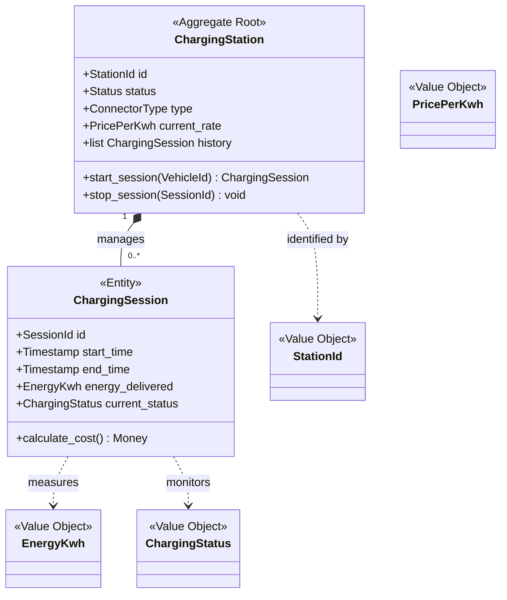

# EV Charging Subdomain: Domain Model & Entity Catalog

This document defines the conceptual core of the EV Charging context using Domain-Driven Design (DDD) tactical patterns. It establishes the entities, value objects, and aggregate boundaries necessary for the transition to a microservices architecture.

## 1. Tactical Domain Model Diagram

## 2. Entity & Value Object Catalog

### Core Entities
| Entity | Role | Identity |
| :--- | :--- | :--- |
| **ChargingStation** | Represents the physical hardware unit. It serves as the **Aggregate Root** for the charging context. | `StationId` |
| **ChargingSession** | Tracks the lifecycle of a single energy transfer event. | `SessionId` |

### Value Objects
| Value Object | Purpose | Attributes |
| :--- | :--- | :--- |
| **StationId** | Unique identifier for a physical station unit. | `uuid` |
| **EnergyKwh** | Cumulative energy measurement for a session. | `decimal (kWh)` |
| **PricePerKwh** | Current billing rate for power consumption. | `decimal (Currency/kWh)` |
| **ChargingStatus** | The active state of a session or station. | `Enum (Available, Charging, Fault, Offline)` |
| **ConnectorType** | Standard of the physical connection. | `Enum (Type2, CCS, CHAdeMO)` |

## 3. Aggregate Boundaries & Consistency Rules

### ChargingStation Aggregate
- **Root:** `ChargingStation`
- **Boundary:** Encompasses the station's metadata and its active/historical sessions.
- **Consistency Rules:**
    - A station cannot initiate a new session if its status is **Fault** or **Offline**.
    - Only one **Active** session is permitted per station at any given time (Transactional Enforcement).
    - Status updates to the station (e.g., hardware fault) must atomically propagate to the active session.

## 4. Design Logic Rationale
1. **Station/Slot Relationship:** To support future **Dual Chargers**, the model decouples `StationId` from the physical Parking Slot ID. The mapping between a Station and a Slot is managed as an external configuration (Facility Topology).
2. **Pricing-Ready VO:** Value objects for `PricePerKwh` and `EnergyKwh` are included to ensure the model supports future billing services without structural refactoring, fulfilling the "Transition Readiness" objective.
