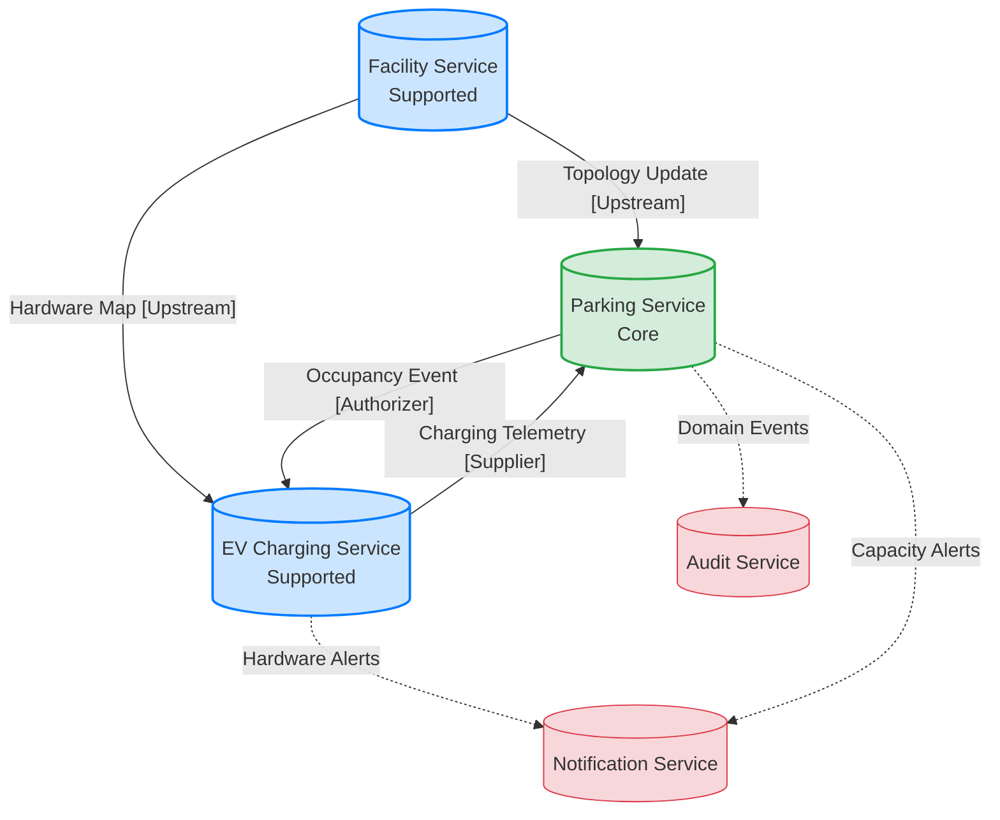

# EasyParkPlus: Microservices Catalog

This catalog defines the technical services, their domain boundaries, and their primary responsibilities. It maps the DDD bounded contexts to an independent, multi-facility scaling architecture.

## 1. Primary Microservices

| Service | Bounded Context | Core Responsibility | Data Ownership |
| :--- | :--- | :--- | :--- |
| **Parking Service** | Parking Allocation | Authoritative real-time occupancy, check-in, check-out, allocation strategy selection. | `Allocation`, `SlotOccupancy` |
| **EV Charging Service** | EV Charging | Hardware telemetry, charging session monitoring, battery level tracking, charger status mapping. | `ChargingStation`, `ChargingSession` |
| **Facility Service** | Facility Management | Static facility topology, floor layouts, slot definitions, zone capacities. | `Facility`, `Level`, `Zone` |

---

## 2. Infrastructure & Supporting Services

| Service | Bounded Context | Core Responsibility |
| :--- | :--- | :--- |
| **IAM Service** | IAM | Role-based access control, authentication, and token management across facilities. |
| **Audit Service** | Audit & Logging | Immutable chronological ledger of all system-wide domain events. |
| **Notification Service** | Notification | Routing system-wide alerts (e.g., "Charger Fault", "Lot Full") to UI and personnel. |

---

## 3. Service Interaction & Context Map

This diagram illustrates the Upstream/Downstream relationships and the primary data flow through the system.

## 4. Architectural Collaboration Patterns

1. **Facility -> Parking (Upstream/Downstream):** The Parking service is technically a "Downstream" consumer of the Facility service's topology. Any physical slot re-configuration in the Facility service forces a state update in the Parking allocation engine.
2. **Parking -> EV Charging (Customer/Supplier):** The EV Charging service "Supplies" status and telemetry to the Parking "Customer." A vehicle's check-in (Parking event) acts as the authorization trigger for the Charging service to unlock hardware.
3. **Event-Driven Resilience:** To maximize autonomy, services communicate via **Asynchronous Domain Events**. For instance, the `VehicleParkedEvent` published by the Parking service is consumed by the EV service to start a charging session, ensuring both systems remain decoupled.
4. **Anti-Corruption Layer (ACL):** The EV Charging service implements an internal ACL to translate heterogeneous hardware signals into the system-wide ubiquitous language before publishing charging updates.
