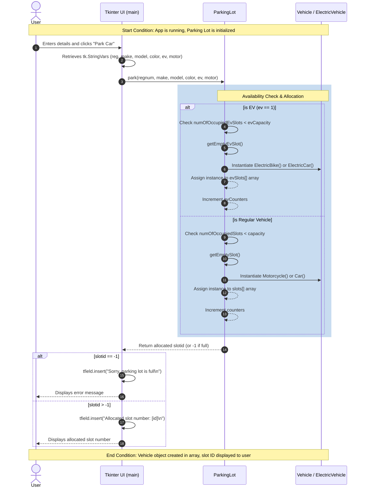

# Original System Design: Behavioral Diagram

## Vehicle Entry Workflow (Pre-Refactor)

This artifact captures the **Original** behavioral sequence of the Parking Lot Manager system before any architectural refactoring. It describes one concrete, end-to-end system flow: a user parking a new vehicle (vehicle entry), highlighting the tight coupling between the Tkinter GUI and domain objects in the baseline system.

## Architectural Review Notes & Iteration Findings

Following an initial review from an architecture/lead engineering perspective (informed by `codebase_health_assessment.md`), the following intrinsic anti-patterns and code health risks are illuminated by this flowchart:

1. **GUI/Domain Blurring (P1 Risk)**: The sequence demonstrates that `ParkingLot` performs both array-management operations (`getEmptyEvSlot()`) AND raw GUI manipulations (`GUI-->>GUI: tfield.insert`). Any attempt to write automated tests or separate the presentation tier is blocked by this design.
2. **Branch-Heavy Allocation Methods (P3 Risk)**: The `park(...)` interaction handles too many responsibilities—capacity checking, sorting between EV and Regular, object instantiation, tracking count—all in one nested monolithic routine.
3. **Weak Encapsulation (P5 Risk)**: The domain object exposes its raw slot arrays (`evSlots[]`, `slots[]`) directly for mutation without abstraction, risking state corruption and race conditions if this prototype is ever scaled or operated asynchronously.
