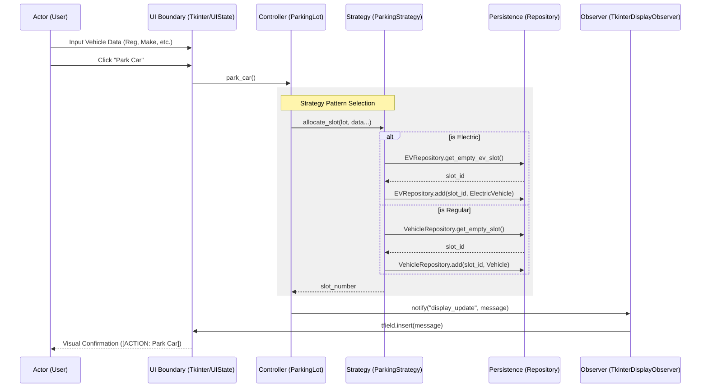

# Post-Refactor Behavioral Architecture

This document presents the behavioral UML sequence for the refactored EasyParkPlus system. It illustrates the dynamic interactions and decoupled message-passing facilitated by the Strategy, Repository, and Observer design patterns.

## Mermaid Sequence Diagram: Vehicle Allocation (Park)

This diagram demonstrates how the `ParkingLot` delegates allocation logic to a `Strategy` and state persistence to a `Repository`, finally notifying the `UI` via an `Observer`.

## Behavioral Improvements & EV Integration

1. **Decoupled Data Flow:** The diagram shows that the `ParkingLot` (Controller) no longer manages the vehicle list directly. It delegates to the `Strategy` for logic and the `Repository` for storage.
2. **EV Charging Integration:** The sequence explicitly branches to the `EVRepository` when the electric flag is detected, ensuring EV-specific attributes (like charge levels) are managed within their own domain context.
3. **Observer Encapsulation:** Unlike the legacy code where the domain logic updated the UI directly (monolithic anti-pattern), the refactored flow uses a push-based `notify()` mechanism. This ensures the domain logic remains "UI-ignorant."
4. **Behavioral Accuracy:** This sequence represents the removal of the *Control Coupling* anti-pattern, as the `ParkingLot` no longer contains the internal branching logic for specific vehicle types; it simply executes the polymorphic `allocate_slot` method.
