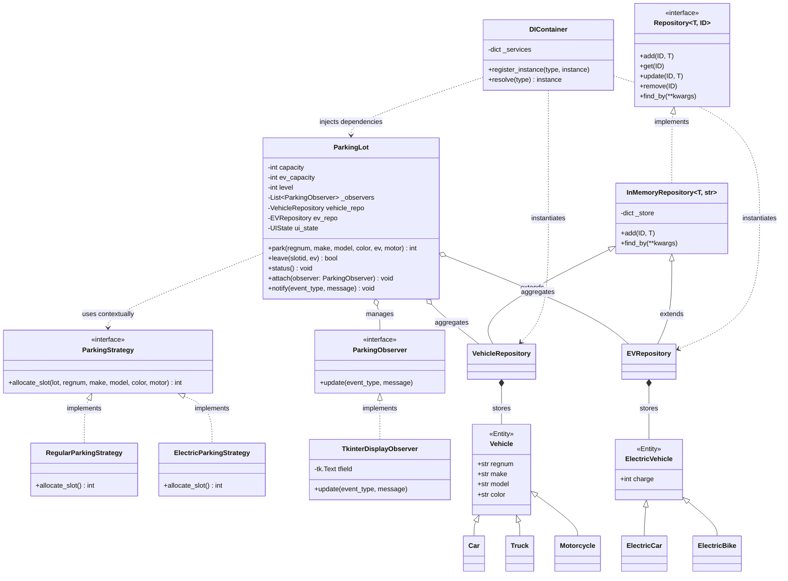

# Post-Refactor Structural Architecture

This document contains the structural UML representation of the modernized `EasyParkPlus` codebase. It highlights the successful remediation of legacy anti-patterns (global variables, monolithic classes) through the explicit decoupling of domain models, persistence layers, and UI views using industry-standard design patterns.

## Mermaid Class Diagram

## Highlights & Structural Improvements

1. **Strategy Pattern Illustration:** The `ParkingLot` context dynamically selects between `RegularParkingStrategy` and `ElectricParkingStrategy`. This resolved the legacy branching logic mapping (Control Coupling Anti-Pattern).
2. **Repository Pattern Illustration:** The `InMemoryRepository` decouples the aggregate domain logic (`ParkingLot`) from physical storage operations. This resolved the monolithic array-looping logic mapping (God Class Anti-Pattern).
3. **Observer Pattern Illustration:** The `TkinterDisplayObserver` is injected asynchronously mapped via logic events (`notify()`), completely detaching UI view operations from domain algorithms (Presentation logic leak).
4. **Dependency Injection & Multi-Facility Support:** Because `DIContainer` is responsible for registering state instances, a larger system can easily instantiate multiple `ParkingLot` models and inject disparate `VehicleRepositories` dynamically, enabling multi-lot operation.
